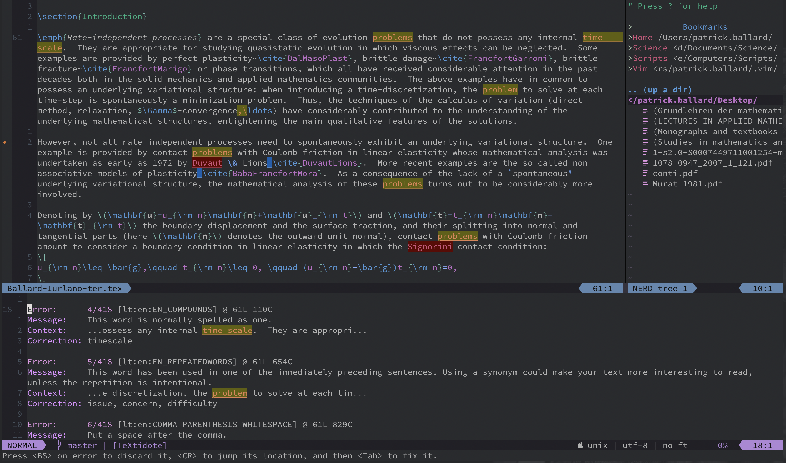
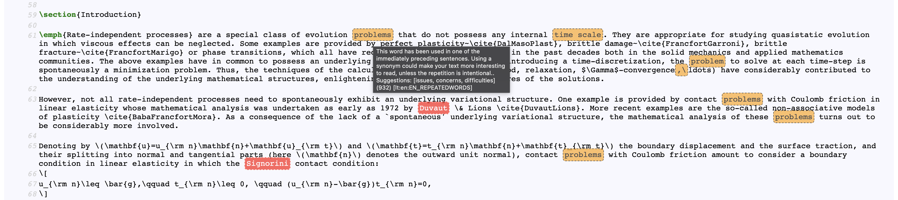

# vim-textidote

## Description

This plugin interfaces Vim and Neovim with the [TeXtidote][TeXtidote] grammar checker.  TeXtidote is an open source spelling, grammar and style checker for multiple languages based on LanguageTool.  TeXtidote is built on top of LanguageTool and is able to remove LaTeX and Markdown markup before grammar checking, while keeping track of the relative position of words between the original and "clean text". In short, TeXtidote is a version of LanguageTool made blind to LaTeX and Markdown markup.

Ths plugin provides asynchronous integration of TeXtidote both in Vim and Neovim, with higlighting of the errors and warnings. It offers also easy and intuitive navigation of the errors, as well as quick fixes by <Tab> completion.

## Screenshots

Example in Vim:

Html report in browser:

## Installation

Install `vim-textidote` using your favorite package manager, or use Vim's built-in package support:

    mkdir -p ~/.vim/pack/PatrBal/start
    cd ~/.vim/pack/PatrBal/start
    git clone https://github.com/PatrBal/vim-textidote
    vim -u NONE -c "helptags vim-textidote/doc" -c q

Download the latest `textidote.jar` from [TeXtidote][TeXtidote] and make sure that you have Java version 8 or later installed on your system. Specify the location of the file `textidote.jar` in your $HOME/.vimrc file. Example:

	let g:textidote_jar = '~/.vim/textidote.jar'

## Usage
`:[range]TeXtidoteToggle`  
By default `[range]` is the whole buffer, except in the case where there is a visual selection which is then taken as the default `[range]`.

## Features
 - Asynchronous spell, grammar and style checking of either the entire buffer or part of it, with highlighing of the errors and warnings.
 - A scratch buffer shows up, listing all the errors.  Navigate the errors using `[` and `]`, both in the scratch buffer and in the original buffer. Hit `<Enter>` on an error in the scratch buffer to jump to that error. Hit `<Tab>` on an error in the original buffer to fix it.
 - The location-list is populated, so that you can use location-list Vim commands such as `:lopen` to open the location-list window, `:lne` to jump to the next error, etc.
 - Optionally, a full html report of TeXtidote analysis can be displayed in the default browser.

## Alternative

A very good alternative is to use the [LTeX][LTeX] language server with `coc.nvim`. It is also based on LanguageTool and is aware of LaTeX or Markdown markup. It provides grammar checking *as you type*, but does not currently offer suggestions or quick fixes in Vim or Neovim. `LTeX` can be both an alternative to `vim-textidote` or an addition.

## License

Copyright (c) Patrick Ballard.  Distributed under the same terms as Vim itself.
See `:help license`.

## Credit

This plugin is strongly based on the excellent [vim-LanguageTool][vim-LanguageTool].  Large parts of its code have been reused.

[TeXtidote]: https://github.com/sylvainhalle/textidote
[vim-LanguageTool]: https://github.com/dpelle/vim-LanguageTool
[LTeX]: https://valentjn.github.io/ltex
